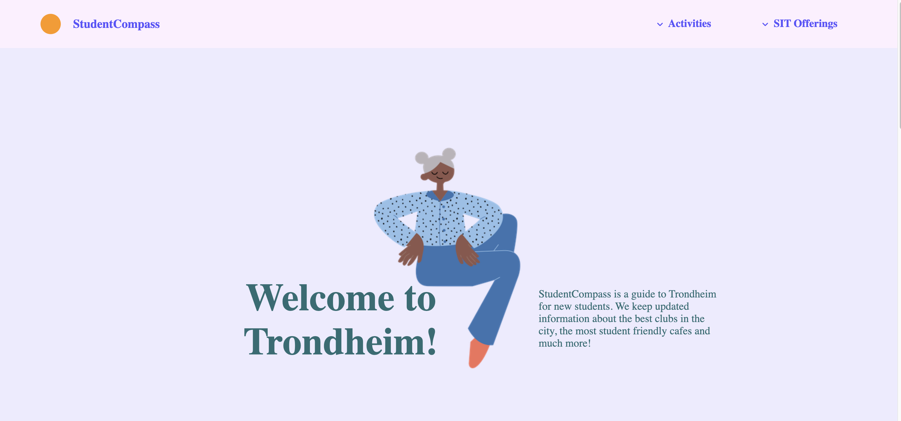

# Student Guide to Trondheim - IT2805 Web Technology Project

This repository hosts the project for the IT2805 - Web Technology course at NTNU Trondheim. Our project, titled "Student Guide to Trondheim," is a comprehensive guide designed for students, featuring information about bars and clubs, fitness centers, cafes, hikes, and other student-relevant activities in Trondheim.

The guide aims to provide students with easy access to information about leisure and lifestyle options in the city, enhancing their overall experience in Trondheim.

